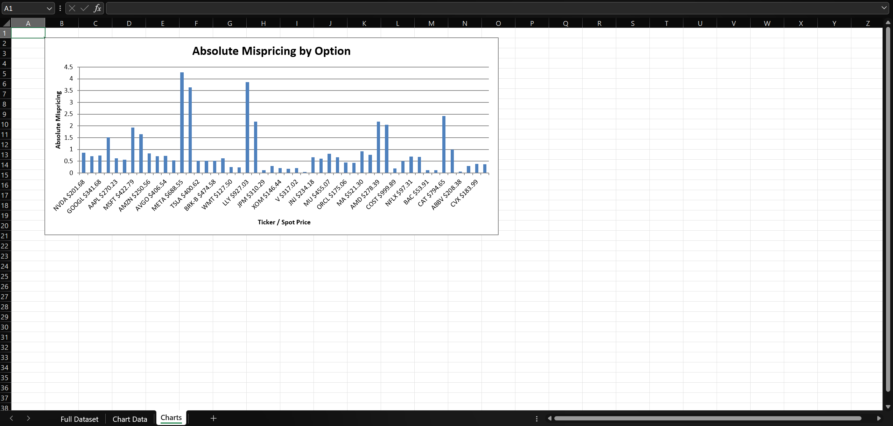
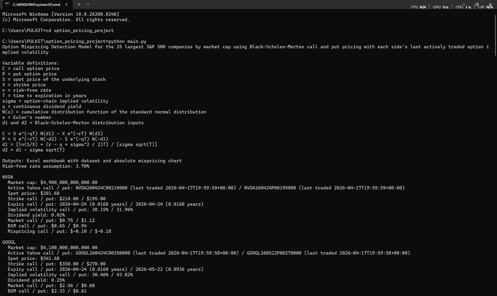
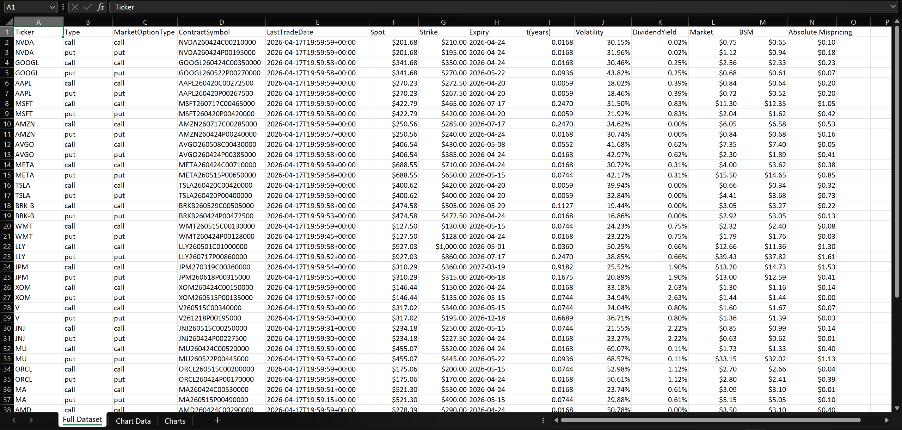
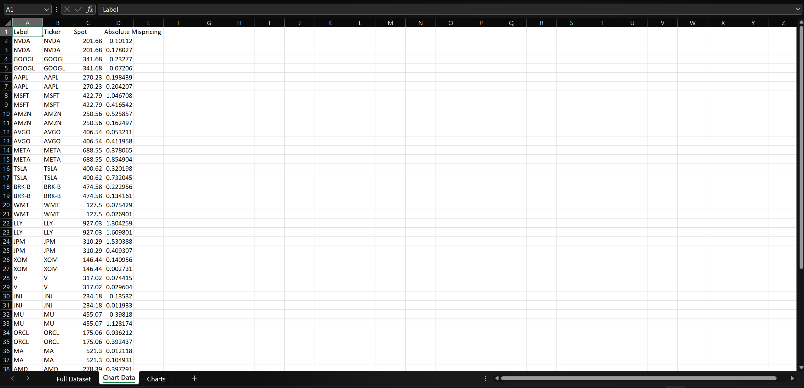

# Option Pricing & Mispricing Detection (Black–Scholes–Merton)

## Overview

This project is a command-line research engine that prices equity options using the Black–Scholes–Merton (BSM) model and compares theoretical prices with real market data from Yahoo Finance.

It identifies potential option mispricing across the 25 largest S&P 500 companies by market capitalization using each contract’s **actual implied volatility, strike, and expiry**.

---

## Features

* Black–Scholes–Merton pricing for **calls and puts**

* Dividend-aware option pricing

* Real-time option chain data from Yahoo Finance

* Uses **last actively traded contracts** for realistic pricing inputs

* Computes **absolute mispricing**:

  **|Market Price − BSM Price|**

* Processes **Top 25 large-cap equities**

* Modular code structure with unit tests

* Exports results to Excel with visualization

---

## Results & Outputs

### Mispricing Visualization


### Sample Console Output


### Dataset Snapshot


### Chart Data Preview


---

## How It Works

1. Fetch top 25 companies by market cap
2. Retrieve active call and put options from Yahoo Finance
3. Extract:

   * Spot price
   * Strike
   * Expiry
   * Implied volatility
4. Compute BSM price
5. Compare against market price
6. Calculate absolute mispricing
7. Export dataset + chart to Excel

---

## Project Structure

```
.
├── main.py              # CLI workflow and Excel output
├── bsm.py               # Black-Scholes-Merton pricing logic
├── data_fetch.py        # Market data retrieval and option selection
├── tests/               # Unit tests
├── images/              # Output screenshots for README
├── outputs/             # Sample Excel output
├── README.md
├── requirements.txt
├── pyproject.toml
```

---

## Setup

### Windows

```
python -m venv .venv
.\.venv\Scripts\Activate.ps1
python -m pip install --upgrade pip
python -m pip install -r requirements.txt
```

### macOS / Linux

```
python3 -m venv .venv
source .venv/bin/activate
python -m pip install --upgrade pip
python -m pip install -r requirements.txt
```

---

## Run

```
python main.py
```

This generates:

```
option_pricing_analysis.xlsx
```

Containing:

* Full dataset
* Absolute mispricing calculations
* Bar chart visualization

---

## Testing

Run unit tests:

```
python -m unittest discover -s tests
```

---

## Notes

* Option data is sourced from Yahoo Finance and may be delayed or incomplete
* Contracts are selected based on **most recent trading activity**
* Call and put options may have different expiries due to market liquidity
* Results vary over time as they depend on live market data

---

## Key Observations

* Higher implied volatility stocks exhibit larger deviations
* Short-dated options tend to show more pricing noise


