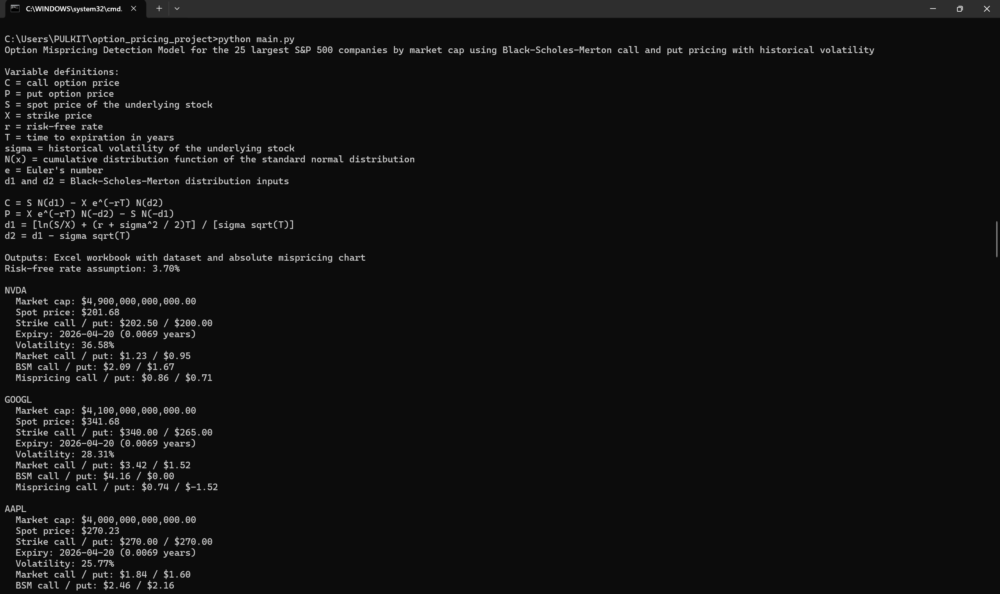
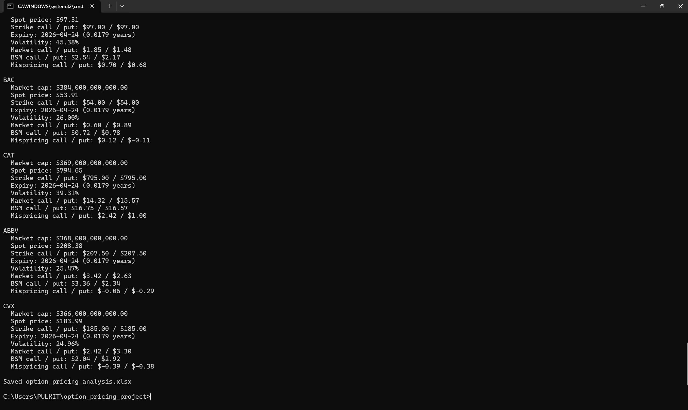
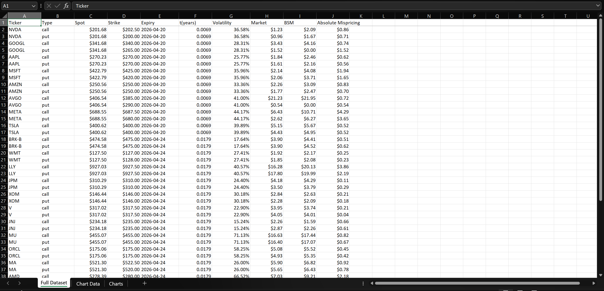
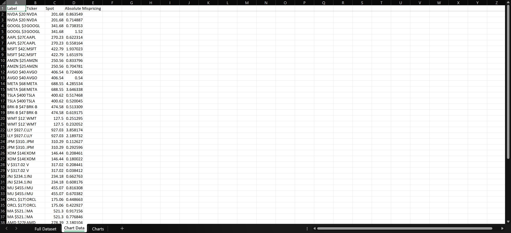

# Option Pricing and Mispricing Detection

Command line research engine for pricing near the money equity options with the Black Scholes Merton equations and comparing model prices with Yahoo Finance market prices.

## Features

- Uses a fixed Top 25 large cap equity index in `data_fetch.py`.
- Fetches the nearest available option expiry from Yahoo Finance.
- Selects near the money calls and puts using current spot price.
- Estimates annualized historical volatility from recent daily returns.
- Prices options with Black Scholes Merton.
- Writes an Excel workbook with the full dataset and a mispricing chart.

## Results & Outputs
## Output Data

Download full resulting dataset:
[option_pricing_analysis.xlsx](option_pricing_analysis.xlsx)

### Terminal Execution




---

### Full Dataset



---

### Chart Data



---

### Mispricing Visualization


## Project Structure

```text
.
|-- bsm.py              # Black Scholes Merton formulas
|-- data_fetch.py       # Yahoo Finance data retrieval and option selection
|-- main.py             # CLI workflow and Excel workbook writer
|-- requirements.txt    # Runtime dependencies
|-- pyproject.toml      # Project metadata
`-- tests/
    `-- test_bsm.py     # Standard library unit tests
```

## Requirements

- Python 3.10 or newer
- Internet access for live yahoo finance market data
Python 3.11 or 3.12 is recommended for the broadest scientific package compatibility.

## Setup

Create and activate a virtual environment:

```powershell
python -m venv .venv
.\.venv\Scripts\Activate.ps1
python -m pip install --upgrade pip
python -m pip install -r requirements.txt
```

On macOS or Linux:

```bash
python3 -m venv .venv
source .venv/bin/activate
python -m pip install --upgrade pip
python -m pip install -r requirements.txt
```

## Verify

Run the formula tests:

```powershell
python -m unittest discover -s tests
```

## Run

```powershell
python main.py
```

The command writes `option_pricing_analysis.xlsx` in the project directory. This workbook is generated output containing BSM price calculations and mispricing analysis.

## Notes

Yahoo Finance option chains may be delayed, incomplete, or unavailable for some tickers. The engine skips tickers with missing or unusable option data so the remaining index can still process.

The market-cap index is fixed in source code for repeatable ticker selection, Pricing results will still vary over time because they depend on live market data.
