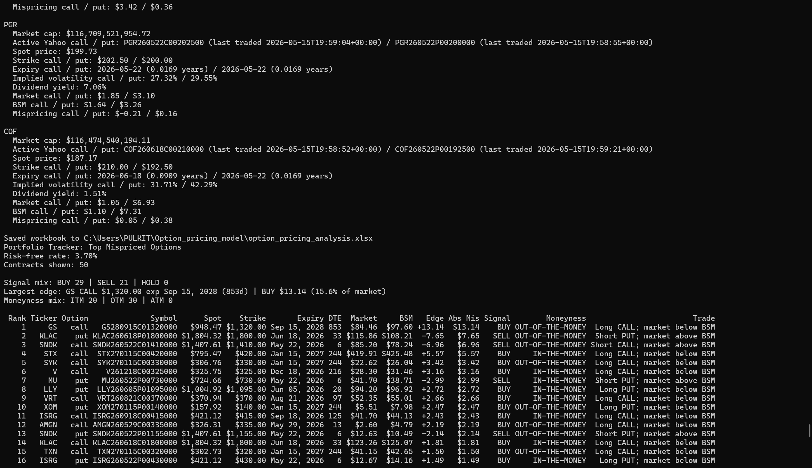

# Option Mispricing Detection and Spread Construction using Black Scholes Merton

A quantitative finance command line research engine that prices equity options of the **top 100 S&P 500 companies by market capitalization** using the **Black Scholes Merton (BSM) equations**, compares theoretical values against live Yahoo Finance market prices for each contract, detects potential mispricing opportunities, and generates an option spread of top 50 mispriced contracts along with trade signals.

The engine evaluates a dynamic basket of the top 100 S&P 500 companies by live Reuters market cap ranking.

---
## Sample Output

### Initial Processing Output


---

### Option Spread Construction and Final Signal Output



---

### Full Dataset Export


---

### Chart Data Worksheet


---

### Mispricing Visualization


---

## Download Sample Output Workbook

[Download Sample Excel Workbook](option_pricing_analysis.xlsx)

---
## Project Structure

```text
.
|-- bsm.py
|-- data_fetch.py
|-- main.py
|-- pricing_engine.py
|-- option_pricing_analysis.xlsx
|-- tests/
|-- images/
|   |-- console.png
|   |-- portfolio_tracker.png
|   |-- dataset.png
|   |-- chart.png
|   `-- mispricing_chart.png
|-- requirements.txt
|-- pyproject.toml
`-- README.md
```

---

## Installation

Clone the repository:

```bash
git clone https://github.com/PS11242026/Option_pricing_model.git
cd Option_pricing_model
```

Install dependencies:

```bash
pip install -r requirements.txt
```

Optional development tools:

```bash
pip install -e ".[dev]"
```

---

## Usage

Run the full pricing engine:

```bash
python pricing_engine.py
```

This generates:

- `option_pricing_analysis.xlsx`

Workbook sheets:

- `Full Dataset`
- `Chart Data`
- `Charts`
  
## Quantitative Methodology

This project uses the Black Scholes Merton framework to estimate fair option values based on:

- Underlying stock price
- Strike price
- Time to expiry
- Risk free interest rate
- Implied volatility
- Dividend yield

Theoretical values are compared against observed market prices to identify potentially underpriced and overpriced contracts.

---

## Features

- Black Scholes Merton pricing for calls and puts
- Dividend accounted option valuation
- Live stock, option chain, and market cap data ingestion
- Automatic liquid contract selection based on recent trading activity
- Model vs market mispricing detection
- BUY / SELL / HOLD portfolio signal generation
- Excel workbook export with structured datasets and visual analytics
- Console progress tracking during market data processing
- Option spread construction of top mispriced opportunities
- Automated chart generation for quick visual analysis
- Unit tests for pricing logic, option selection, parsing and CLI output

---


## Testing

Run unit tests:

```bash
python -m pytest
```

---

## Notes

- Market data is sourced from Yahoo Finance and Reuters.
- Live market data may be delayed, incomplete, or temporarily unavailable.
- Contracts are selected using liquidity and recent trading activity heuristics.
- Call and put expiries may differ because the most actively traded contract is selected independently.
- Results change over time as live market conditions update.
- This project is intended for quantitative research and educational use only, this is not financial advice.
