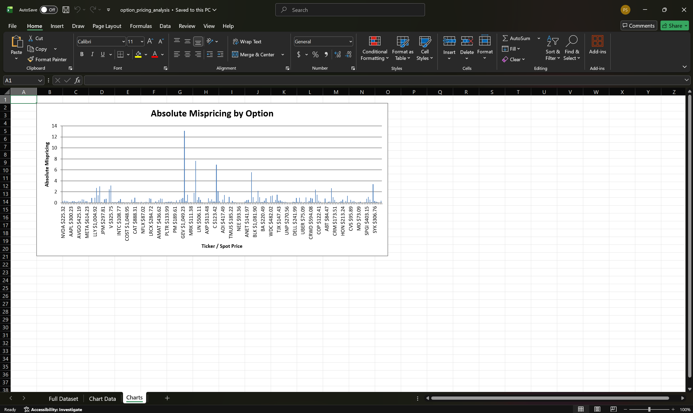
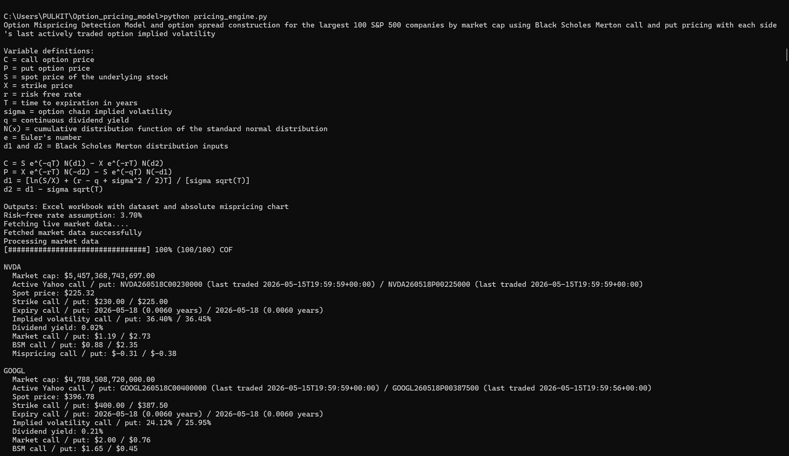
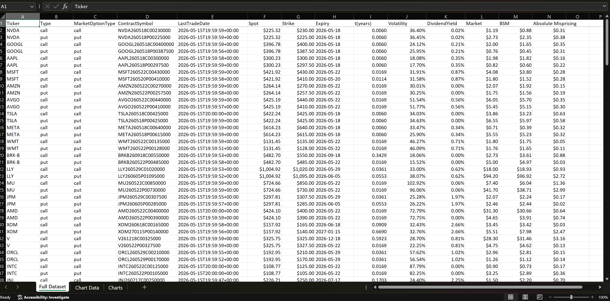
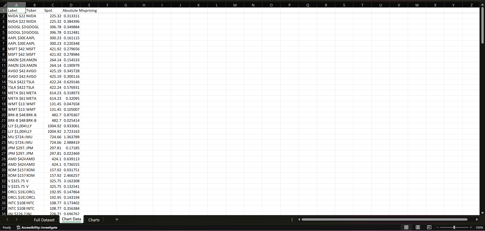

# Option Mispricing Detection Model and Portfolio Tracker

Command-line research engine for pricing equity options with the Black Scholes Merton (BSM) model, comparing theoretical prices against live Yahoo Finance option data, and ranking the largest model-vs-market mispricing opportunities.

The default universe is the top 100 S&P 500 companies by live Reuters market-cap ranking.

## Features

- Prices calls and puts with dividend-aware BSM formulas
- Pulls live market-cap, stock, and option-chain data
- Selects the most recently traded liquid call and put contracts per ticker
- Shows a console progress bar calibrated to processed companies
- Exports the full dataset and mispricing chart to Excel
- Prints a portfolio tracker with BUY / SELL / HOLD signals
- Includes unit tests for pricing, data parsing, option selection, CLI output, and tracker logic

## Project Structure

```text
.
|-- bsm.py
|-- data_fetch.py
|-- main.py
|-- pricing_engine.py
|-- tests/
|-- images/
|-- requirements.txt
|-- pyproject.toml
`-- README.md
```

## Setup

```powershell
python -m venv .venv
.\.venv\Scripts\Activate.ps1
python -m pip install --upgrade pip
python -m pip install -r requirements.txt
```

On macOS or Linux, activate the virtual environment with:

```bash
source .venv/bin/activate
```

For development and tests, install the optional tooling:

```bash
python -m pip install -e ".[dev]"
```

## Run

Run the full pricing engine and portfolio tracker:

```bash
python main.py
```

This creates `option_pricing_analysis.xlsx` with:

- `Full Dataset`
- `Chart Data`
- `Charts`

Run only the tracker command with a custom number of displayed contracts:

```bash
python pricing_engine.py --top 10
```

After installing the project as a package, the console scripts are:

```bash
option-pricing
portfolio-tracker --top 10
```

## Testing

```bash
python -m pytest
```

## Output Examples

### Mispricing Visualization


### Sample Console Output


### Dataset Snapshot


### Chart Data Preview


## Notes

- Market data is sourced from Yahoo Finance and Reuters and may be delayed, incomplete, or temporarily unavailable.
- Contracts are selected based on recent trading activity and basic liquidity filters.
- Call and put options can have different expiries because the tracker uses the most active contract for each side.
- Results vary over time because they depend on live market data.
- This project is for research and education, not financial advice.
